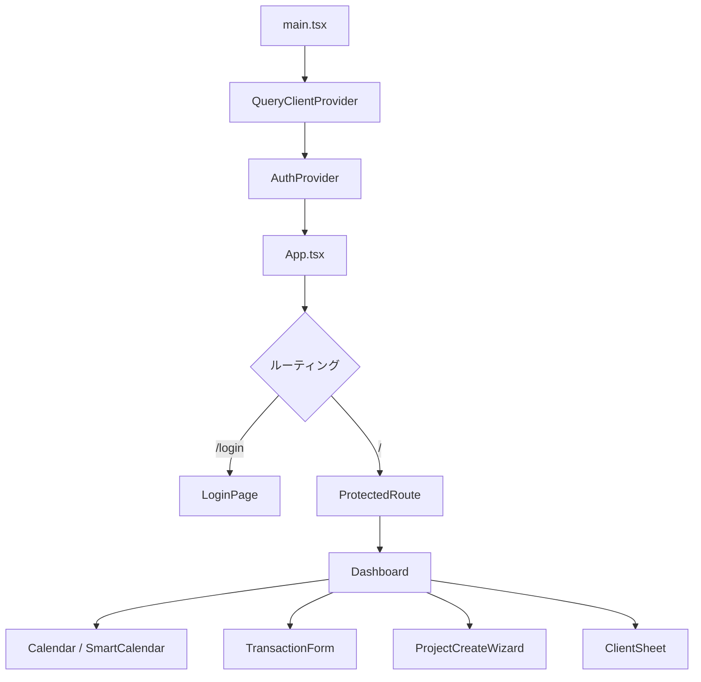

# GANTACT (BizFlow Mobile) - 開発引き継ぎドキュメント

> **最終更新日**: 2026-02-12  
> **バージョン**: v1.1.1  
> **アプリ名**: GANTACT（旧名: BizFlow Mobile）

---

## 1. アプリ概要

**GANTACT** は中小企業向けの **資金繰り管理PWA（Progressive Web App）** です。  
スマートフォンでの爆速入力を前提に設計されており、以下の機能を提供します。

| 機能 | 説明 |
|------|------|
| **入出金管理** | 収入・支出をカレンダー上で登録・閲覧 |
| **2モードカレンダー** | 発生日ベース（accrual）/ 入金日ベース（cash）/ 案件ビュー（project） |
| **取引先管理** | 締日・入金サイトに基づく自動入金予定日計算 |
| **案件（プロジェクト）管理** | ガントチャート風のカレンダーバー表示・PL管理 |
| **定期取引** | 毎月/毎年の固定費・収入を自動生成 |
| **オフライン対応** | PWA + Firestore永続化キャッシュ |

---

## 2. 技術スタック

| レイヤー | 技術 | バージョン |
|----------|------|------------|
| **フレームワーク** | React | 19.2.0 |
| **ビルドツール** | Vite | 7.2.4 |
| **言語** | TypeScript | 5.9.3 |
| **スタイリング** | Tailwind CSS | 3.4.19 |
| **状態管理** | Zustand | 5.0.10 |
| **データフェッチ** | TanStack React Query | 5.90.19 |
| **BaaS/データベース** | Firebase (Auth + Firestore) | 12.8.0 |
| **ルーティング** | React Router DOM | 7.12.0 |
| **UIコンポーネント** | Framer Motion / Lucide React / Vaul (Drawer) | 各最新 |
| **フォーム** | React Hook Form + Zod | 7.71.1 / 4.3.6 |
| **日付処理** | date-fns | 4.1.0 |
| **金額計算** | decimal.js | 10.6.0 |
| **DnD** | @dnd-kit | 6.3.1 |
| **PWA** | vite-plugin-pwa | 1.2.0 |
| **ホスティング** | Vercel | - |
| **フォント** | Inter + Noto Sans JP (Google Fonts) | - |

---

## 3. ディレクトリ構造

```
d:\app\bizflow-mobile\
├── .agent/workflows/         # 開発ワークフロー定義
│   └── version-bump.md       #   バージョンアップ手順
├── .env.local                # ★ 開発用環境変数（gitignore対象）
├── .env.local.example        #   開発用テンプレート
├── .env.production           # ★ 本番用環境変数（gitignore対象）
├── .env.production.example   #   本番用テンプレート
├── .firebaserc               # Firebase プロジェクト紐付け
├── .gitignore
├── DEPLOY.md                 # デプロイ手順
├── README.md
├── firebase.json             # Firebase設定（Emulator/Hosting/Firestore）
├── firestore.indexes.json    # Firestore 複合インデックス定義
├── firestore.rules           # Firestore セキュリティルール（486行）
├── index.html                # エントリHTML（PWA Cache Buster含む）
├── memo.txt                  # Firebase設定メモ
├── package.json              # npm設定
├── postcss.config.js
├── tailwind.config.js        # Tailwind カスタムテーマ
├── tsconfig.json             # TypeScript設定
├── tsconfig.app.json
├── tsconfig.node.json
├── vercel.json               # Vercel デプロイ設定（キャッシュヘッダー）
├── vite.config.ts            # Vite + PWA設定
├── デプロイ方法.txt            # デプロイ手順書（日本語）
│
├── public/                   # 静的アセット
│   ├── apple-touch-icon.png
│   ├── favicon.ico / favicon.png
│   ├── pwa-192x192.png
│   ├── pwa-512x512.png
│   ├── robots.txt
│   └── vite.svg
│
└── src/
    ├── main.tsx              # ★ アプリケーション起点
    ├── App.tsx               # ルーティング定義
    ├── App.css
    ├── index.css             # グローバルCSS + Tailwind
    ├── vite-env.d.ts         # Vite環境変数型定義
    │
    ├── assets/               # 画像など
    │
    ├── config/
    │   └── subscription.ts   # プラン制限設定（現在FREE/無制限）
    │
    ├── types/
    │   └── index.ts          # ★ 全データモデル型定義
    │
    ├── lib/                  # コアライブラリ
    │   ├── firebase.ts       # ★ Firebase初期化・認証ヘルパー
    │   ├── utils.ts          # cn(), formatCurrency(), formatDate() 等
    │   ├── settlement.ts     # ★ 入金予定日計算ロジック
    │   ├── recurringUtils.ts # ★ 定期取引発生日計算・トランザクション生成
    │   ├── projectHelpers.ts # プロジェクトヘルパー
    │   ├── transactionHelpers.ts # トランザクションヘルパー
    │   └── financeHelpers.ts # 金融計算ヘルパー（utils/配下にも関連ファイル）
    │
    ├── utils/
    │   ├── currencyMath.ts   # 通貨計算（decimal.js）
    │   └── financeHelpers.ts # 金融ヘルパー
    │
    ├── stores/
    │   └── appStore.ts       # ★ Zustand グローバルストア
    │
    ├── hooks/                # カスタムフック群
    │   ├── index.ts          # バレルエクスポート
    │   ├── useAuth.ts        # Firebase認証フック
    │   ├── useClients.ts     # 取引先CRUD
    │   ├── useTransactions.ts # 取引CRUD
    │   ├── useProjects.ts    # 案件CRUD
    │   ├── useProjectOperations.ts # 案件操作（PLなど）
    │   ├── useProjectInteraction.ts # カレンダー上の案件ドラッグ等
    │   ├── useRecurringMasters.ts   # 定期取引マスタCRUD
    │   ├── useRecurringTransactionProcessor.ts # 定期取引自動生成
    │   ├── useHaptic.ts      # バイブレーションフィードバック
    │   └── useVisualViewport.ts # モバイルキーボード対策
    │
    ├── pages/                # ページコンポーネント
    │   ├── Dashboard.tsx     # ★ メインダッシュボード（35KB・最大ファイル）
    │   ├── ClientManagementPage.tsx # 取引先管理
    │   ├── RecurringSettings.tsx    # 定期取引設定
    │   └── SettingsPage.tsx  # アプリ設定
    │
    ├── components/           # 共通UIコンポーネント
    │   ├── layout/
    │   │   └── AppLayout.tsx
    │   ├── onboarding/
    │   │   └── SpotlightTour.tsx  # 初回チュートリアル
    │   ├── pwa/
    │   │   └── ReloadPrompt.tsx   # PWA更新通知
    │   └── ui/
    │       ├── Button.tsx
    │       ├── Card.tsx
    │       ├── ConfirmDrawer.tsx   # 確認ダイアログ（Drawer型）
    │       ├── DatePicker.tsx      # 日付選択
    │       ├── FloatingActionMenu.tsx # FABメニュー
    │       ├── Keypad.tsx          # テンキー入力
    │       ├── Skeleton.tsx        # ローディング
    │       ├── ToggleSwitch.tsx
    │       ├── ViewToggle.tsx      # 表示モード切替
    │       └── index.ts
    │
    └── features/             # 機能モジュール
        ├── auth/             # 認証
        │   ├── AuthProvider.tsx    # 認証コンテキスト
        │   ├── LoginPage.tsx      # ログイン画面
        │   ├── ProtectedRoute.tsx # 認証ルートガード
        │   └── index.ts
        │
        ├── calendar/         # カレンダー
        │   ├── Calendar.tsx       # メインカレンダー
        │   ├── TransactionList.tsx # 取引一覧
        │   ├── components/
        │   │   ├── CalendarDayCell.tsx   # 日付セル
        │   │   ├── DateTransactionsSheet.tsx # 日付別取引シート
        │   │   ├── DraggableProjectBar.tsx   # ドラッグ可能プロジェクトバー
        │   │   ├── DroppableCalendarCell.tsx # ドロップ先セル
        │   │   ├── ProjectPopover.tsx        # プロジェクト詳細ポップオーバー
        │   │   └── SmartCalendar.tsx         # スマートカレンダー
        │   ├── hooks/
        │   │   ├── useCalendarGrid.ts    # カレンダーグリッド計算
        │   │   └── useCalendarLayout.ts  # レイアウト計算
        │   ├── types.ts
        │   └── index.ts
        │
        ├── clients/          # 取引先
        │   ├── ClientSheet.tsx         # 取引先選択シート
        │   ├── components/
        │   │   └── ClientSelectField.tsx
        │   └── index.ts
        │
        ├── dashboard/        # ダッシュボード
        │   └── CalendarContainer.tsx   # カレンダーコンテナ
        │
        ├── projects/         # 案件
        │   ├── components/
        │   │   ├── ProjectCreateWizard.tsx  # 案件作成ウィザード
        │   │   ├── ProjectDetailSheet.tsx   # 案件詳細シート
        │   │   ├── ProjectListView.tsx      # 案件一覧
        │   │   └── ProjectPLCard.tsx        # PL（損益）カード
        │   ├── hooks/
        │   │   ├── useProjectFinancials.ts  # 案件財務計算
        │   │   └── useProjectWizard.ts      # ウィザード状態管理
        │   └── index.ts
        │
        ├── recurring/        # 定期取引
        │   ├── RecurringMasterForm.tsx  # 登録フォーム
        │   ├── RecurringMasterList.tsx  # 一覧表示
        │   ├── UpdateModeDialog.tsx     # 更新モード選択
        │   └── index.ts
        │
        └── transactions/     # 取引
            ├── TransactionForm.tsx       # 取引登録フォーム
            ├── components/
            │   └── ProjectSelectorSheet.tsx # 案件選択シート
            └── index.ts
```

---

## 4. データモデル（Firestore構造）

### コレクション構造

```
users/{userId}/
├── transactions/{transactionId}
├── clients/{clientId}
├── projects/{projectId}
├── recurring_masters/{masterId}
└── categories/{categoryId}    ← 将来用
```

> **重要**: 全データはユーザーIDのサブコレクションに格納される（マルチテナント）

### 4.1 Client（取引先）

| フィールド | 型 | 説明 |
|------------|-----|------|
| `id` | string | ドキュメントID |
| `uid` | string | ユーザーID（セキュリティ用） |
| `name` | string | 取引先名 |
| `closingDay` | number | 締日（1-31, 99=月末） |
| `paymentMonthOffset` | number | 入金サイト（0=当月, 1=翌月...） |
| `paymentDay` | number | 支払日（1-31, 99=月末） |
| `sortOrder` | number? | 表示順序 |
| `createdAt` | Timestamp | 作成日 |

### 4.2 Transaction（取引）

| フィールド | 型 | 説明 |
|------------|-----|------|
| `id` | string | ドキュメントID |
| `uid` | string | ユーザーID |
| `type` | `'income' \| 'expense'` | 収入/支出 |
| `amount` | string | 金額（decimal.js用にstring） |
| `taxRate` | string | 税率（例: "0.1"） |
| `transactionDate` | Timestamp? | **発生日** |
| `settlementDate` | Timestamp? | **入金/支払予定日**（自動計算） |
| `isSettled` | boolean | 消込フラグ |
| `clientId` | string? | 取引先ID |
| `categoryId` | string? | カテゴリID |
| `memo` | string? | メモ |
| `projectId` | string? | 紐付く案件ID |
| `isEstimate` | boolean? | 見込みフラグ（案件自動生成時） |
| `recurringMasterId` | string? | 定期取引マスタID |
| `recurringInstanceDate` | Timestamp? | 本来の予定日（追跡用） |
| `isDetached` | boolean? | 逸脱フラグ（個別変更時true） |

### 4.3 Project（案件）

| フィールド | 型 | 説明 |
|------------|-----|------|
| `id` | string | ドキュメントID |
| `uid` | string | ユーザーID |
| `clientId` | string | 取引先ID（必須） |
| `title` | string | 案件名 |
| `startDate` | Timestamp? | 開始日 |
| `endDate` | Timestamp? | 終了日（納品予定日） |
| `status` | `'draft' \| 'confirmed' \| 'completed'` | ステータス |
| `color` | `'blue' \| 'orange' \| 'green' \| 'purple' \| 'gray'` | カレンダー表示色 |
| `estimatedAmount` | string | 見積金額 |
| `memo` | string? | メモ |
| `tags` | string[]? | タグ（Phase 4） |
| `progress` | number? | 進捗率 0-100 |
| `urls` | string[]? | 関連リンク |
| `isImportant` | boolean? | 重要フラグ |

### 4.4 RecurringMaster（定期取引マスタ）

| フィールド | 型 | 説明 |
|------------|-----|------|
| `id` | string | ドキュメントID |
| `uid` | string | ユーザーID |
| `title` | string | タイトル |
| `baseAmount` | string | 基本金額 |
| `type` | `'income' \| 'expense'` | 収入/支出 |
| `frequency` | `'monthly' \| 'yearly'` | 頻度 |
| `dayOfPeriod` | number | 日（1-31, 31=月末） |
| `monthOfYear` | number? | 月（yearlyのみ, 1-12） |
| `startDate` | Timestamp? | 開始日 |
| `endDate` | Timestamp? | 終了日（nullなら無期限） |
| `isActive` | boolean | 有効/無効 |

---

## 5. アーキテクチャ・設計思想

### 5.1 アプリケーション構成



### 5.2 状態管理

| 状態の種類 | 管理方法 | 永続化 |
|-----------|----------|--------|
| UIの状態（表示モード, カレンダー表示等） | Zustand（`appStore.ts`） | localStorage（一部） |
| サーバーデータ（取引, 取引先, 案件等） | TanStack React Query | Firestore永続化キャッシュ |
| 認証状態 | Firebase Auth + `AuthProvider` | Firebase SDK |
| フォーム状態 | React Hook Form | なし |

### 5.3 カレンダーの3つのモード

| モード | 説明 | キー |
|--------|------|------|
| **cash** | 入金/支払日（`settlementDate`）ベースで表示 | デフォルト |
| **accrual** | 発生日（`transactionDate`）ベースで表示 | - |
| **project** | 案件をガントチャート風バーで表示 | - |

### 5.4 入金予定日の自動計算フロー

```
取引登録 → 取引先選択 → 締日・入金サイトから自動算出
例: 月末締め翌月25日払い → settlement.ts の calculateSettlementDate() で計算
```

### 5.5 定期取引の仕組み

1. `RecurringMaster` で定期ルールを定義
2. `useRecurringTransactionProcessor` が期間内のTransactionを自動生成
3. 個別変更された場合は `isDetached: true` で追跡
4. 無期限ルールは6ヶ月先を閾値に自動延長

---

## 6. Firebase設定

### 6.1 プロジェクト情報

| 項目 | 値 |
|------|-----|
| **プロジェクトID** | `bizflow-mobile-4e5bc` |
| **Firebase コンソール** | https://console.firebase.google.com/u/0/project/bizflow-mobile-4e5bc |

### 6.2 使用サービス

- **Firebase Authentication** - Google ログイン（ポップアップ方式）
- **Cloud Firestore** - メインデータベース（永続化キャッシュ有効）
- **Firebase Hosting** - 未使用（Vercelを使用）

### 6.3 エミュレータ構成

| サービス | ポート |
|----------|--------|
| Auth | 9099 |
| Firestore | 8080 |
| Emulator UI | 4000 |

> ⚠️ 現在 Java エラーにより Emulator が起動できない状態。開発時も本番 Firebase に直推接続で運用中。

### 6.4 セキュリティルール

`firestore.rules` に486行のゼロトラスト設計ルールを定義:

- **認証必須**: 全操作にFirebase Auth認証が必要
- **所有権検証**: ユーザーは自分のサブコレクションのみ操作可能
- **スキーマバリデーション**: 全フィールドの型・形式を検証
- **イミュータブル保護**: `uid`, `createdAt` の変更を禁止

### 6.5 複合インデックス

`firestore.indexes.json` に13個の複合インデックスを定義（取引の日付ソート、案件のステータス+日付フィルタ等）。

---

## 7. 環境変数

### 7.1 一覧

| 変数名 | 説明 | 開発 | 本番 |
|--------|------|------|------|
| `VITE_USE_EMULATOR` | Emulator接続 | `false`* | `false` |
| `VITE_FIREBASE_API_KEY` | Firebase APIキー | 実値 | 実値 |
| `VITE_FIREBASE_AUTH_DOMAIN` | Auth ドメイン | 実値 | 実値 |
| `VITE_FIREBASE_PROJECT_ID` | プロジェクトID | 実値 | 実値 |
| `VITE_FIREBASE_STORAGE_BUCKET` | Storage バケット | 実値 | 実値 |
| `VITE_FIREBASE_MESSAGING_SENDER_ID` | FCM送信者ID | 実値 | 実値 |
| `VITE_FIREBASE_APP_ID` | アプリID | 実値 | 実値 |

> *本来はEmulatorを使うべきだが、Java環境の問題で `false` に設定中

### 7.2 環境切り替えの仕組み

`src/lib/firebase.ts` にて:
- `VITE_USE_EMULATOR=true` → Emulator接続（ダミー設定で動作）
- `VITE_USE_EMULATOR=false` → 本番Firebase接続（永続化キャッシュ有効）

---

## 8. Git & デプロイ

### 8.1 リポジトリ

| 項目 | 値 |
|------|-----|
| **リモート** | `https://github.com/arimaro0217/bizflow-mobile.git` |
| **ブランチ** | `main`（シングルブランチ運用） |

### 8.2 Vercelデプロイ

- GitHubの`main`ブランチにプッシュすると **自動デプロイ**
- 環境変数はVercel Dashboard > Settings > Environment Variablesで設定
- `vercel.json` で `sw.js`, `index.html`, `manifest.webmanifest` のキャッシュ無効化ヘッダーを設定

### 8.3 Firestoreルールのデプロイ

```bash
firebase deploy --only firestore
```

> 失敗時はFirebase Console > Firestore > ルール から手動コピペで適用可能

---

## 9. PWA設定

### 9.1 設定概要

`vite.config.ts` で以下を設定:

- **自動更新モード**: `registerType: 'autoUpdate'`（ユーザー操作不要）
- **プリキャッシュ**: js, css, html, ico, png, svg, woff2
- **ランタイムキャッシュ**:
  - HTML → `NetworkFirst`（最新優先）
  - 静的アセット → `StaleWhileRevalidate`（高速表示優先）
  - Google Fonts → `CacheFirst` / `StaleWhileRevalidate`
  - Firebase API → `NetworkOnly`（Firebase SDKに委任）

### 9.2 Cache Buster

`index.html` にインラインスクリプトとして埋め込み:
- `localStorage` にバージョン番号を保存
- バージョン不一致時に全SW削除 + キャッシュクリア + リロード

---

## 10. バージョン管理ワークフロー

`.agent/workflows/version-bump.md` に定義:

### 更新対象（3箇所）

1. **`package.json`** → `version` フィールド
2. **`src/features/auth/LoginPage.tsx`** → ログイン画面のバージョン表示
3. **`src/pages/SettingsPage.tsx`** → 設定画面の `GANTACT vX.X.X`

### バージョニングルール

- **パッチ** (`x.x.X`): バグ修正、小さな調整
- **マイナー** (`x.X.0`): 新機能追加、大きな修正
- **メジャー** (`X.0.0`): 破壊的変更

### 注意事項

`index.html` 内の `APP_VERSION` 変数もバージョンに合わせて更新が必要（Cache Buster用）。

---

## 11. ローカル開発手順

```bash
# 1. クローン
git clone https://github.com/arimaro0217/bizflow-mobile.git
cd bizflow-mobile

# 2. 依存関係インストール
npm install

# 3. 環境変数設定
# .env.local.example を .env.local にコピーして値を設定
cp .env.local.example .env.local

# 4. 開発サーバー起動
npm run dev

# 5. ビルド
npm run build

# 6. プレビュー
npm run preview
```

---

## 12. ビルド設定

### Rollup チャンク分割

`vite.config.ts` の `manualChunks`:

| チャンク名 | 含むパッケージ |
|-----------|---------------|
| `vendor-react` | react, react-dom, react-router-dom |
| `vendor-firebase` | firebase/app, firebase/auth, firebase/firestore |
| `vendor-ui` | framer-motion, lucide-react, vaul, date-fns, decimal.js |

---

## 13. スタイリング

### Tailwind カスタムテーマ

| カラー | 用途 | 値 |
|--------|------|-----|
| `primary` | ブランドカラー（グリーン系） | `#22c55e` |
| `income` | 収入表示 | `#3b82f6`（青） |
| `expense` | 支出表示 | `#ef4444`（赤） |
| `surface` | ダークモード背景 | `#1f2937` |

### フォント

`Inter` + `Noto Sans JP`（Google Fonts CDN）

---

## 14. 認証フロー

1. `AuthProvider` で `onAuthStateChanged` を監視
2. 未認証 → `/login` にリダイレクト
3. Googleポップアップ認証（`signInWithPopup`）
4. 認証成功 → `/`（Dashboard）にリダイレクト
5. `ProtectedRoute` が全保護ページをラップ

> モバイルでも `signInWithPopup` を使用（リダイレクト方式はループが発生するため廃止）

---

## 15. 既知の注意点・過去の課題

| 課題 | 状況 | 対応 |
|------|------|------|
| Firebase Emulatorが起動しない | ⚠️ 未解決 | Java環境の問題。開発時も本番に直接接続 |
| モバイルキーボードでのビューポート崩れ | ✅ 解決 | `useVisualViewport.ts` で `visualViewport` APIを使用 |
| SWのキャッシュが残り更新されない | ✅ 解決 | Cache Buster + `autoUpdate` + Vercelのno-cache設定 |
| Google認証でリダイレクトループ | ✅ 解決 | モバイルもポップアップ方式に統一 |
| キーパッド使用後のUI崩れ | ✅ 解決 | Keypad/DatePickerをDrawer外に配置 |

---

## 16. 今後の拡張予定（Phase 4+のフィールドとして準備済み）

- タグ機能（`Project.tags`）
- 進捗管理（`Project.progress`）
- 関連リンク（`Project.urls`）
- 重要フラグ（`Project.isImportant`）
- カテゴリ管理（`categories` コレクション・ルール定義済み）
- サブスクリプションプラン（`config/subscription.ts` に定義、現在無制限）
